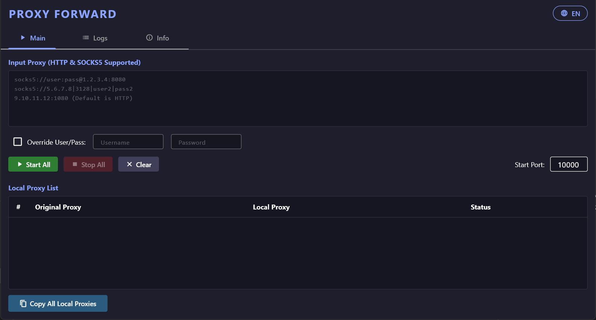

# Proxy Forwarder 🚀

A lightweight, cross-platform local proxy forwarder built with Flutter. 

**Proxy Forwarder** acts as a bridge between your local applications and remote authenticated proxies. It creates unauthenticated local ports (e.g., `127.0.0.1:10000`) and seamlessly injects your credentials (Username/Password) before forwarding the traffic to the remote proxy. It features a modern graphical user interface (GUI) and a robust Headless CLI mode for Linux VPS/Servers.

 *(Note: Replace this link with the actual path to your uploaded screenshot)*

## ✨ Features

* **Multi-Protocol Support:** Handles HTTP, SOCKS5, and SOCKS5H proxies.
* **Smart Authentication Injection:** Automatically handles HTTP Basic Auth headers and SOCKS5 binary handshakes. Your local tools don't need to support proxy authentication!
* **Headless CLI Mode:** Run entirely without a GUI on servers (perfect for 24/7 background tasks on Ubuntu VPS).
* **Cross-Platform:** Compiled to native machine code for Windows and Linux.
* **Auto-Save:** Remembers your proxy lists, override credentials, and language preferences.
* **Real-time Logs:** Built-in terminal-like log viewer to monitor incoming connections and errors.
* **Bilingual UI:** Supports both English and Vietnamese.

## 🛠 Prerequisites

To build this project from the source, you will need:
* [Flutter SDK](https://docs.flutter.dev/get-started/install) (3.x or higher)
* **Windows:** Visual Studio 2022 with "Desktop development with C++" workload installed.
* **Linux (Ubuntu/Debian):** `sudo apt install clang cmake ninja-build pkg-config libgtk-3-dev`

## 🚀 Installation & Build

1. **Clone the repository:**
```bash
git clone [https://github.com/sansamour/proxy_forwarder.git](https://github.com/sansamour/proxy_forwarder.git)
cd proxy_forward
````

2.  **Get dependencies:**

```bash
flutter pub get
```

3.  **Build for your OS:**

      * **For Windows:**

        ```bash
        flutter build windows --release
        ```

        *The executable will be located in `build\windows\x64\runner\Release\`*

      * **For Linux:**

        ```bash
        flutter build linux --release
        ```

        *The executable will be located in `build/linux/x64/release/bundle/`*

## 💻 Usage

### 1\. GUI Mode (Desktop)

Simply double-click the compiled executable (`proxy_forward.exe` or `./proxy_forward`).

  * Paste your proxy list into the text area. Supported formats:
      * `ip:port:user:pass`
      * `ip|port|user|pass`
      * `socks5://user:pass@ip:port`
      * `socks5h://ip:port:user:pass`
  * Set a starting port (e.g., `10000`).
  * Click **Start All**. The app will sequentially open `127.0.0.1:10000`, `127.0.0.1:10001`, etc.

### 2\. Headless Mode (CLI / Servers)

Perfect for running on a VPS without a display interface. Use the `--headless` flag.

**Basic Usage:**

```bash
./proxy_forward --headless --proxies "socks5://1.2.3.4:8080\n5.6.7.8|3128" --startport 10000
```

**Overriding User/Pass for all proxies:**

```bash
./proxy_forward --headless --proxies "socks5://1.2.3.4:8080\n5.6.7.8:3128" --overwrite --user "admin" --pass "secret123" --startport 10000
```

**Running 24/7 with PM2 (Recommended for Linux VPS):**
If you want to keep the forwarder running in the background and auto-restart on crashes, use [PM2](https://pm2.keymetrics.io/):

```bash
# If your server doesn't have a display at all, use xvfb-run to bypass GTK checks:
sudo apt install xvfb -y

# Start with PM2
pm2 start "xvfb-run ./proxy_forward --headless --proxies '1.2.3.4:8080' --startport 10000" --name "ProxyForwarder"
```

## 📦 Dependencies

  * [`shared_preferences`](https://pub.dev/packages/shared_preferences) - For saving UI state.
  * [`args`](https://pub.dev/packages/args) - For parsing CLI arguments in headless mode.

## 📄 License

This project is licensed under the MIT License - see the [LICENSE](https://www.google.com/search?q=LICENSE) file for details.
